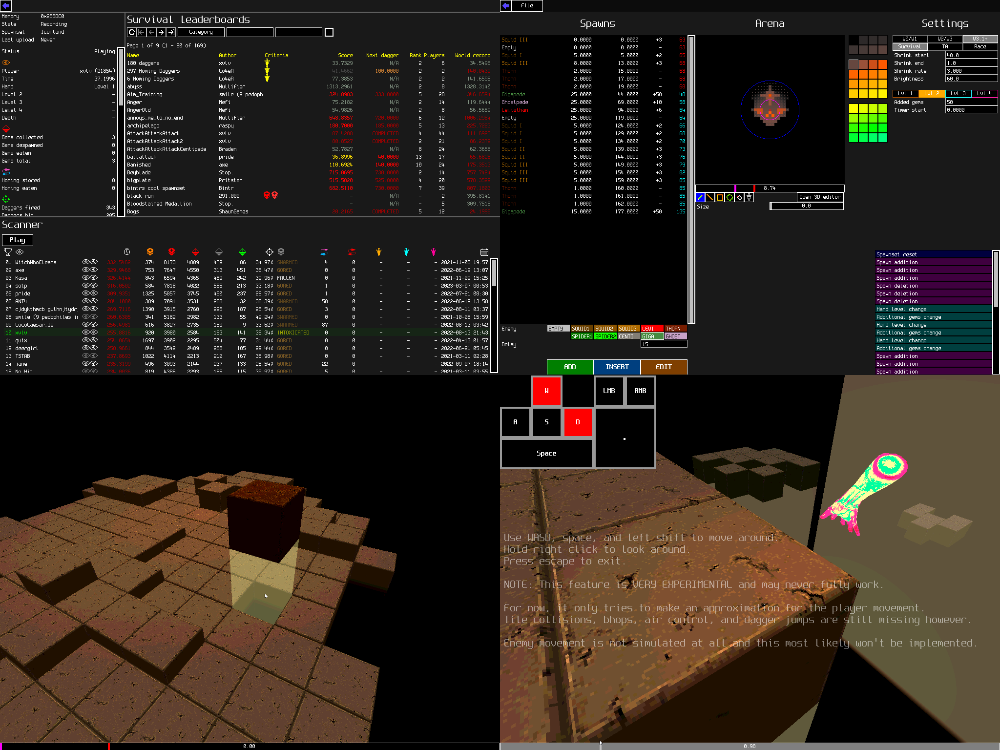

# DevilDaggersInfo

DevilDaggersInfo consists of a website and some tools created specifically for the game Devil Daggers.

## Website

The website is hosted on [devildaggers.info](https://devildaggers.info/).

## Tools

The tools can be downloaded on [devildaggers.info/tools](https://devildaggers.info/tools/).

## Website features

- Viewing and searching the official leaderboards
- Viewing leaderboard data for any player
- Hosting custom spawnsets
  - Spawns list and accurate end loop timings
  - Accurate arena previewer with shrink slider
- Hosting custom leaderboards
  - 4 categories (Survival, Time Attack, Race, Speedrun)
  - Criteria system that allows for more interesting ways to play spawnsets
  - Hosting replays for every score (as of Devil Daggers V3.2)
  - Hosting graph data for every score (as of Devil Daggers V3.1)
- Hosting mods
- Wiki pages for enemy types, spawns, upgrades, and more
- Various leaderboard statistics
  - List of world records
  - World record progression graph
  - Global history statistics
- Leaderboard history that updates every day
- Player settings data
  - Users can make an account on the website to save their settings
- An admin portal for moderators to upload spawnsets and mods, manage custom leaderboards and player data, and more
- A public web API for:
  - The new ddinfo tools
  - [DDSE 2 (deprecated)](https://github.com/NoahStolk/DevilDaggersSurvivalEditor)
  - [DDCL 1 (deprecated)](https://github.com/NoahStolk/DevilDaggersCustomLeaderboards)
  - [DDAE 1 (deprecated)](https://github.com/NoahStolk/DevilDaggersAssetEditor)
  - [ddstats-rust](https://github.com/lsaa/ddstats-rust)
  - [DDLIVE](https://github.com/rotisseriechicken/DDLIVE)
  - [Clubber](https://github.com/Spoertm/Clubber)
  - Devil Daggers itself

## Tools features

The new tools are currently in development. The new tools app is a complete rewrite of the old Windows-only tools, combined into one app. The new tools app will be cross-platform.

These features are currently implemented:

- Custom leaderboards

These features are currently being worked on:

- Survival editor including a 3D editor
- Replay previewer including input visualization

These features are planned:

- Renewed spawnset manager
- Dedicated and simplified practice functionality
- Renewed asset editor for mods
- Renewed mod manager
- Replay previewer (and possibly editor)
- Replay enemy tracking

These features are planned but may not be possible to implement:

- Replay movement and the ability to compare speedrun/race replays using a ghost system in 3D

The current deprecated apps are not included in this repository. Visit these repositories:

- [Survival Editor](https://github.com/NoahStolk/DevilDaggersSurvivalEditor)
- [Custom Leaderboards](https://github.com/NoahStolk/DevilDaggersCustomLeaderboards)
- [Asset Editor](https://github.com/NoahStolk/DevilDaggersAssetEditor)

## Libraries

The DevilDaggersInfo project offers a couple libraries for parsing and creating Devil Daggers files.

### Survival files (spawnsets)

Spawnsets mainly consist of an arena and a set of spawns. All features are supported in the Core.Spawnset library.

### Replay files

Devil Daggers replay files can be interpreted by the Core.Replay library. The library can also create replay files. The library understands almost all replay data.

### Mod files

Mods can be created for Devil Daggers using the Core.Mod library. The library can extract all the original Devil Daggers assets, and also recompile custom assets into mods.

Audio (.wav), meshes (.obj), object bindings (text), GLSL shaders (text), and textures (.png) are supported.

Particle files are not supported (yet).

### Reading game memory

The tools app provides a way to read live game memory from the game in real time. This is primarily used for custom leaderboards, but it can also be used for other purposes.
