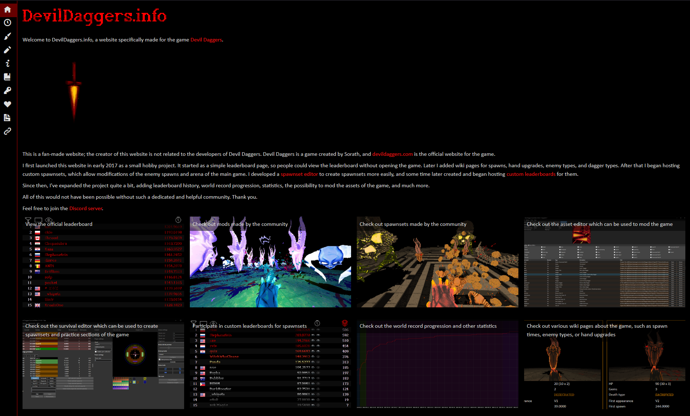
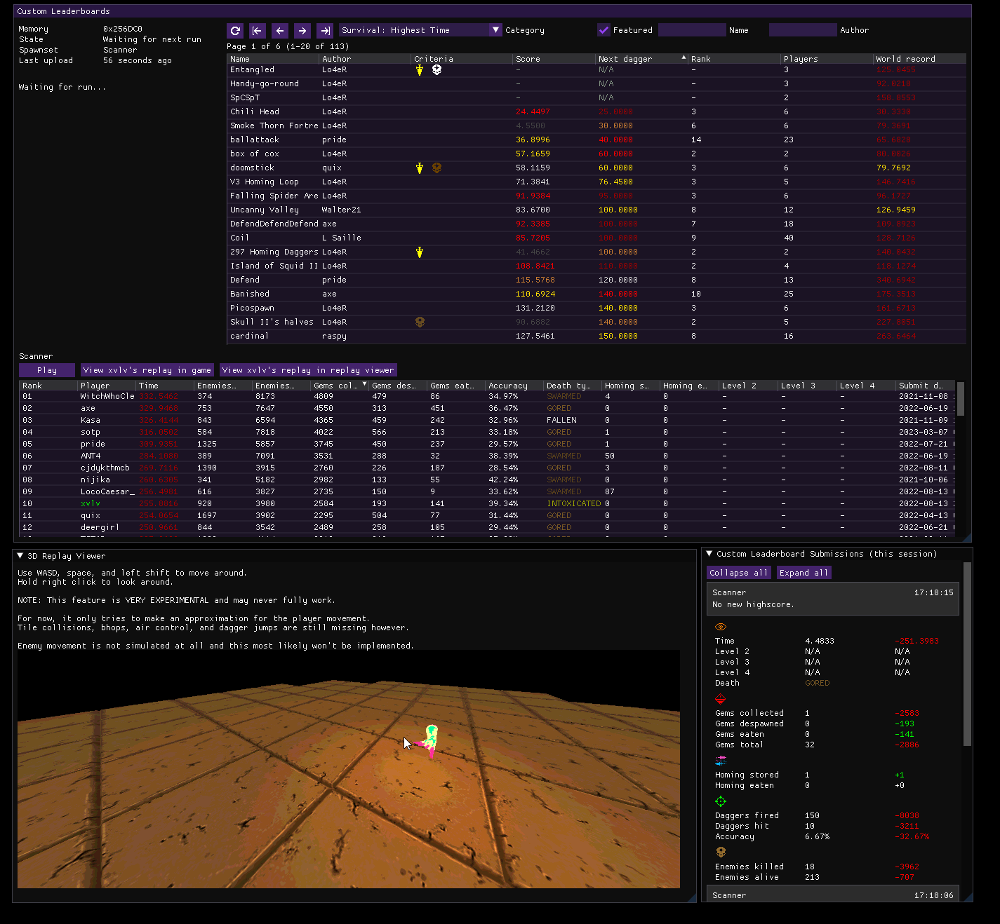
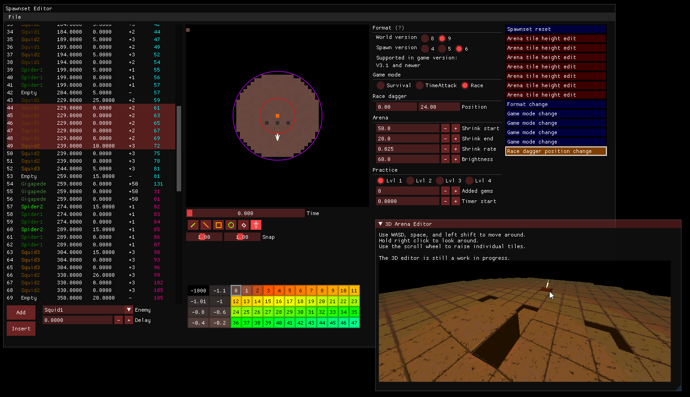
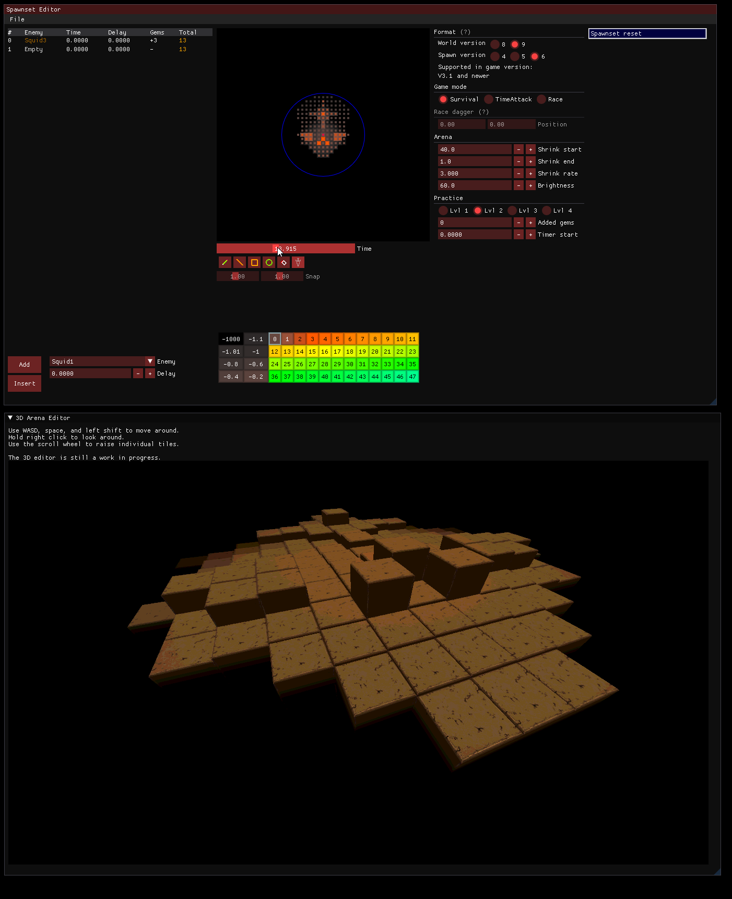
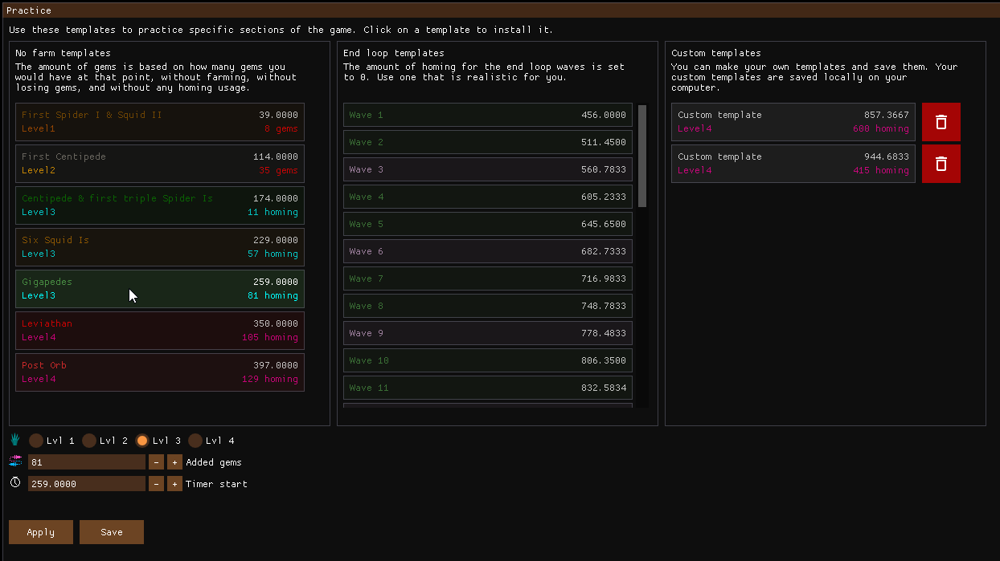

# DevilDaggersInfo

DevilDaggersInfo consists of a website, web server, and various tools created specifically for the game Devil Daggers.

The purpose of the project is to make it easier for players to play and understand the game, and to provide a platform for the community to create and share custom spawnsets (levels), mods, participate in custom leaderboards, and a lot more.

While the project provides many ways to practice and modify the game, it does **not** allow you to cheat, or encourage cheating at all. You are also asked to not redistribute the game assets, and only use them for modding purposes.

Most of these features have been discussed with the community and the developer of Devil Daggers (Sorath), some of which have been done in collaboration.

**This repository contains the entire DevilDaggersInfo project, which consists of many features.**

## [devildaggers.info](https://devildaggers.info/) website

### Features

- Viewing and searching the official leaderboards
- Viewing leaderboard data for any player
- Browsing leaderboard history, statistics, world record progression, player settings, and more
- Displaying custom spawnsets (levels) made by the community
  - Spawns list and accurate end loop timings
  - Accurate arena previewer with shrink slider
- Displaying mods made by the community
  - Mods can be downloaded directly from the website
  - Asset types and information about the mod is displayed
- Viewing custom leaderboards for spawnsets
  - Data for custom scores can be viewed, as well as replay statistics in the form of graphs
  - Custom replays can be downloaded directly from the website
- Guides on how to use and create custom spawnsets and mods
- Accurate wiki pages
  - Enemy types
  - List of spawns
  - Hand upgrades
  - Dagger types
  - List of game assets (the actual assets are not included)
- Editing your player settings (if you have an account)
- Browsing the APIs
- An admin portal for moderators to upload spawnsets and mods, manage custom leaderboards and player data, and more

## Web server

The web server is responsible for serving the website and providing various APIs used by the website and the tools, but also by other projects, such as DDLIVE, ddstats-rust, Clubber, and Devil Daggers itself.

### Features

- Integration with the official leaderboards
- Keeping track of leaderboard history, statistics, and world record progression for the official leaderboards
- Storing player settings data that can be maintained by the player themselves if they have an account
- Hosting custom spawnsets
- Hosting custom leaderboards
  - Supports every game mode in the game (Survival, Time Attack, Race)
  - Allows sorting leaderboards by not just time, but various other statistics as well, such as:
    - Gems collected/despawned/eaten
    - Enemies killed/alive
    - Homing stored/eaten
  - Criteria system that allows for more interesting ways to play spawnsets, such as leaderboards where the player is not allowed to kill certain enemies
  - Hosting replays for every score
  - Hosting graph data for every score
- Hosting mods
- Providing APIs used by the website, as well as APIs for:
  - The tools app
  - The deprecated Windows-only tools
    - [DDSE 2](https://github.com/NoahStolk/DevilDaggersSurvivalEditor)
    - [DDAE 1](https://github.com/NoahStolk/DevilDaggersAssetEditor)
  - [ddstats-rust](https://github.com/lsaa/ddstats-rust)
  - [DDLIVE](https://github.com/rotisseriechicken/DDLIVE)
  - [Clubber](https://github.com/Spoertm/Clubber)
  - Devil Daggers itself

## Tools

### Features

The new tools are currently in development. The new tools app is a complete rewrite of the old Windows-only tools, combined into one app, and will be cross-platform.

#### Custom leaderboards client

#### Spawnset (level) editor including a 3D editor

#### Practice mode

These features are planned or in development:

- Replay previewer including input visualization
- Renewed spawnset manager
- Renewed asset editor for mods
- Renewed mod manager
- Replay previewer (and possibly editor)
- Replay enemy tracking

These features are planned but may not be possible to implement:

- Replay movement and the ability to compare speedrun/race replays using a ghost system in 3D

## Libraries

The DevilDaggersInfo project offers a couple libraries for parsing and creating Devil Daggers files. This is what the website, the web server, and the tools depend on internally.

### Spawnset files

Spawnsets consist of an arena, a set of spawns, practice values, and some other small features. All features are supported in the `DevilDaggersInfo.Core.Spawnset` library.

### Replay files

Devil Daggers replay files can be interpreted by the `DevilDaggersInfo.Core.Replay` library. The library can also create replay files. The library understands almost all replay data and is still in development.

### Mod files

Mods can be created for Devil Daggers using the `DevilDaggersInfo.Core.Mod` library. The library can extract all the original Devil Daggers assets, and also recompile custom assets into mods.

Audio (.wav), meshes (.obj), object bindings (text), GLSL shaders (text), and textures (.png) are supported.

Particle files are not supported (yet).

### Reading game memory

The tools app provides a way to read live game memory from the game in real time. This is primarily used for custom leaderboards, but it can also be used for other purposes, such as for practice or understanding game mechanics.

## Deprecated tools

The original apps are not included in this repository. Visit these repositories:

- [Survival Editor](https://github.com/NoahStolk/DevilDaggersSurvivalEditor)
- [Custom Leaderboards](https://github.com/NoahStolk/DevilDaggersCustomLeaderboards)
- [Asset Editor](https://github.com/NoahStolk/DevilDaggersAssetEditor)
