# Architecture

## Project types and dependencies

### Library layer

| **Subfolder** | **Project type**            | **Can depend on**                                        |
|---------------|-----------------------------|----------------------------------------------------------|
| `api`         | API specifications          | Nothing                                                  |
| `common`      | Common functionality        | Nothing                                                  |
| `core`        | Core set of features        | `common`, `core`                                         |

### UI layer

| **Subfolder** | **Project type**            | **Can depend on**                                        |
|---------------|-----------------------------|----------------------------------------------------------|
| `razor-core`  | Reusable Razor UI libraries | `api`, `common`, `core`, `razor-core`                    |

### App layer

| **Subfolder** | **Project type**            | **Can depend on**                                        |
|---------------|-----------------------------|----------------------------------------------------------|
| `app`         | UI app heads                | `common`, `core`, `razor-core`, `razor`                  |
| `razor`       | Razor UI libraries for apps | `common`, `core`, `razor-core`                           |

### Web layer

| **Subfolder** | **Project type**            | **Can depend on**                                        |
|---------------|-----------------------------|----------------------------------------------------------|
| `web`         | Website (client and server) | `api`, `common`, `core`, `razor-core`, `web-core`, `web` |
| `web-core`    | Reusable web logic          | `common`, `core`, `web-core`                             |

### Miscellaneous

| **Subfolder** | **Project type**            | **Can depend on**                                        |
|---------------|-----------------------------|----------------------------------------------------------|
| `cmd`         | Console apps                | `common`, `core`                                         |
| `tests`       | Unit tests                  | Anything                                                 |
| `tool`        | Tools for internal usage    | Anything                                                 |

## Project hierarchy

Tests, internal tools, source generators, console apps, and common libraries are omitted for clarity.

### End state

```mermaid
flowchart TD;
	ddae[DDAE 2]
	ddcl[DDCL 2]
	ddre[DDRE 1]
	ddse[DDSE 3]

	core_asset[Core.Asset]
	core_customleaderboard[Core.CustomLeaderboards]
	core_encryption[Core.Encryption]
	core_mod[Core.Mod]
	core_nativeinterface[Core.NativeInterface]
	core_replay[Core.Replay]
	core_spawnset[Core.Spawnset]
	core_wiki[Core.Wiki]

	razor_asseteditor[Razor.Core.AssetEditor]
	razor_customleaderboard[Razor.Core.CustomLeaderboard]
	razor_replayeditor[Razor.Core.ReplayEditor]
	razor_survivaleditor[Razor.Core.SurvivalEditor]

	razor_core_canvaschart[Razor.Core.CanvasChart]
	razor_core_unmarshalled[Razor.Core.Unmarshalled]

	web_client[Web.Client]
	web_server[Web.Server]
	web_server_domain[Web.Server.Domain]

	web_core_claims[Web.Core.Claims]

	api_dd[Api.Dd]
	api_clubber[Api.Clubber]
	api_ddlive[Api.DdLive]
	api_ddrust[Api.DdstatsRust]
	api_main[Api.Main]
	api_admin[Api.Admin]
	api_ddae[Api.Ddae]
	api_ddcl[Api.Ddcl]
	api_ddre[Api.Ddre]
	api_ddse[Api.Ddse]

	class api_dd,api_clubber,api_ddlive,api_ddrust,api_ddae,api_ddcl,api_ddre,api_ddse,api_main,api_admin api;
	classDef api fill:#660,stroke:#333,stroke-width:4px;

	class ddae,ddcl,ddre,ddse app;
	classDef app fill:#a00,stroke:#333,stroke-width:4px;

	class core_asset,core_customleaderboard,core_encryption,core_mod,core_nativeinterface,core_replay,core_spawnset,core_wiki core;
	classDef core fill:#006,stroke:#333,stroke-width:4px;

	class razor_asseteditor,razor_customleaderboard,razor_replayeditor,razor_survivaleditor razor;
	classDef razor fill:#800,stroke:#333,stroke-width:4px;

	class razor_core_canvaschart,razor_core_unmarshalled razor_core;
	classDef razor_core fill:#500,stroke:#333,stroke-width:4px;

	class web_client web_client;
	classDef web_client fill:#a66,stroke:#333,stroke-width:4px;

	class web_core_claims web_core;
	classDef web_core fill:#00a,stroke:#333,stroke-width:4px;

	class web_server,web_server_domain web_server;
	classDef web_server fill:#383,stroke:#333,stroke-width:4px;

	subgraph Core
		core_customleaderboard
		core_encryption
		core_nativeinterface

		core_customleaderboard --> core_encryption
		core_mod --> core_asset
		core_replay --> core_spawnset
		core_spawnset --> core_wiki

		razor_core_canvaschart --> razor_core_unmarshalled
	end

	subgraph Api App
		api_ddae
		api_ddcl
		api_ddre
		api_ddse
	end

	razor_asseteditor --> api_ddae
	razor_customleaderboard --> api_ddcl
	razor_replayeditor --> api_ddre
	razor_survivaleditor --> api_ddse

	subgraph Api External
		api_dd
		api_clubber
		api_ddlive
		api_ddrust
	end

	subgraph Api Web
		api_main
		api_admin
	end

	web_server ----> api_dd
	web_server ----> api_clubber
	web_server ----> api_ddlive
	web_server ----> api_ddrust
	web_client --> api_main
	web_client --> api_admin
	web_server ----> api_ddae
	web_server ----> api_ddcl
	web_server ----> api_ddre
	web_server ----> api_ddse

	subgraph Razor
		razor_asseteditor ----> core_mod
		razor_customleaderboard ----> core_customleaderboard
		razor_replayeditor ----> core_replay
		razor_survivaleditor ----> core_spawnset

		razor_asseteditor ----> core_nativeinterface
		razor_customleaderboard ----> core_nativeinterface
		razor_replayeditor ----> core_nativeinterface
		razor_survivaleditor ----> core_nativeinterface
	end

	subgraph Web
		web_client --> razor_core_canvaschart
		web_client ----> web_core_claims
		web_client ----> core_mod
		web_client ----> core_replay
		web_client ----> core_spawnset

		web_server --> core_encryption
		web_server --> web_client
		web_server --> web_server_domain

		web_server_domain --> core_mod
		web_server_domain --> core_replay
		web_server_domain --> core_spawnset
		web_server_domain --> web_core_claims
	end

	subgraph App
		ddae --> razor_asseteditor
		ddcl --> razor_customleaderboard
		ddre --> razor_replayeditor
		ddse --> razor_survivaleditor
	end
```



## Data hierarchy

```mermaid
flowchart TD;
	database[(Database)]
	filesystem[(File system)]
	server[Server]
	api[API]
	devildaggersinfo[Website]
	devildaggers[Devil Daggers (game)]
	ddse[DDSE]
	ddcl[DDCL]
	ddae[DDAE]
	ddstatsrust[ddstats-rust]
	ddlive[DDLIVE]
	clubberserver[Clubber server]
	clubberapi[Clubber API]
	devildaggersleaderboards[Devil Daggers (leaderboards server)]

	class database,filesystem,server,api,devildaggersinfo,ddse,ddcl,ddae ddinfo;
	class devildaggers,ddstatsrust,ddlive,clubberserver,clubberapi,devildaggersleaderboards external;

	classDef ddinfo fill:#a60,stroke:#333,stroke-width:4px;
	classDef external fill:#60a,stroke:#333,stroke-width:4px;

	subgraph External
		devildaggers
		ddstatsrust
		ddlive
		clubberserver
		clubberapi
		devildaggersleaderboards
	end

	devildaggers --> api
	ddstatsrust --> api
	ddlive --> api
	clubberserver --> api

	server --> devildaggersleaderboards
	server --> clubberapi

	subgraph DevilDaggers.info
		server --> database
		server --> filesystem

		api --> server

		devildaggersinfo --> api
		ddse --> api
		ddcl --> api
		ddae --> api
	end
```
