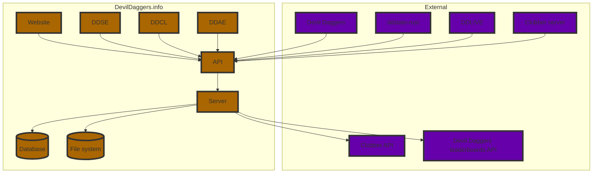

# Architecture

## Project types and dependencies

| **Subfolder** | **Project type**            | **Can depend on**                                        |
|---------------|-----------------------------|----------------------------------------------------------|
| `api`         | API specifications          | Nothing                                                  |
| `app`         | UI apps                     | `api`, `common`, `core`, `razor-core`                    |
| `cmd`         | Console apps                | `api`, `common`, `core`                                  |
| `common`      | Common functionality        | Nothing                                                  |
| `core`        | Core set of features        | `api`, `common`, `core`                                  |
| `razor-core`  | Razor UI libraries          | `api`, `common`, `core`, `razor-core`                    |
| `tests`       | Unit tests                  | Anything                                                 |
| `tool`        | Tools for internal usage    | Anything                                                 |
| `web`         | Website                     | `api`, `common`, `core`, `razor-core`, `web-core`, `web` |
| `web-core`    | Shared web logic            | `api`, `common`, `core`, `web-core`                      |

## Project hierarchy

Tests, internal tools, source generators, console apps, and common libraries are omitted for clarity.

### End state

```mermaid
flowchart TD;
	ddcl[DDCL 2]
	ddae[DDAE 2]
	ddse[DDSE 3]
	ddre[DDRE 1]

	core_asset[Core.Asset]
	core_customleaderboard[Core.CustomLeaderboards]
	core_encryption[Core.Encryption]
	core_mod[Core.Mod]
	core_nativeinterface[Core.NativeInterface]
	core_replay[Core.Replay]
	core_spawnset[Core.Spawnset]
	core_wiki[Core.Wiki]

	razor_core_asseteditor[Razor.Core.AssetEditor]
	razor_core_customleaderboard[Razor.Core.CustomLeaderboard]
	razor_core_replayeditor[Razor.Core.ReplayEditor]
	razor_core_survivaleditor[Razor.Core.SurvivalEditor]
	razor_core_canvaschart[Razor.Core.CanvasChart]
	razor_core_unmarshalled[Razor.Core.Unmarshalled]

	web_client[Web.Client]
	web_server[Web.Server]
	web_server_domain[Web.Server.Domain]
	web_core_claims[Web.Core.Claims]

	api_dd[Api.Dd]
	api_clubber[Api.Clubber]
	api_ddlive[Api.DdLive]
	api_ddrust[Api.DdstatsRust]
	api_main[Api.Main]
	api_admin[Api.Admin]
	api_ddcl[Api.Ddcl]
	api_ddae[Api.Ddae]
	api_ddse[Api.Ddse]
	api_ddre[Api.Ddre]

	class ddae,ddcl,ddre,ddse app;
	class core_asset,core_customleaderboard,core_encryption,core_mod,core_nativeinterface,core_replay,core_spawnset,core_wiki core;
	class razor_core_asseteditor,razor_core_customleaderboard,razor_core_replayeditor,razor_core_survivaleditor,razor_core_canvaschart,razor_core_unmarshalled razor_core;
	class web_client web_client;
	class web_server,web_server_domain web_server;
	class web_core_claims web_core;
	class api_dd,api_clubber,api_ddlive,api_ddrust,api_ddae,api_ddcl,api_ddse,api_ddre,api_main,api_admin api;

	classDef app fill:#a00,stroke:#333,stroke-width:4px;
	classDef core fill:#006,stroke:#333,stroke-width:4px;
	classDef razor_core fill:#066,stroke:#333,stroke-width:4px;
	classDef web_client fill:#a66,stroke:#333,stroke-width:4px;
	classDef web_server fill:#6a6,stroke:#333,stroke-width:4px;
	classDef web_core fill:#00a,stroke:#333,stroke-width:4px;
	classDef api fill:#660,stroke:#333,stroke-width:4px;

	subgraph Core
		core_customleaderboard
		core_encryption
		core_nativeinterface
		core_replay

		core_customleaderboard --> core_encryption
		core_mod --> core_asset
		core_spawnset --> core_wiki
	end

	subgraph Api Tool
		api_ddcl
		api_ddae
		api_ddse
		api_ddre
	end

	subgraph Api External
		api_dd
		api_clubber
		api_ddlive
		api_ddrust
	end

	subgraph Api Web
		api_main
		api_admin
	end

	web_server ----> api_dd
	web_server ----> api_clubber
	web_server ----> api_ddlive
	web_server ----> api_ddrust
	web_client ----> api_main
	web_client ----> api_admin
	web_server ----> api_ddcl
	web_server ----> api_ddae
	web_server ----> api_ddse
	web_server ----> api_ddre

	subgraph Razor Core Web
		razor_core_canvaschart --> razor_core_unmarshalled
	end

	subgraph Razor Core Tool
		razor_core_asseteditor ----> core_mod
		razor_core_customleaderboard ----> core_customleaderboard
		razor_core_replayeditor ----> core_replay
		razor_core_survivaleditor ----> core_spawnset

		razor_core_asseteditor ----> core_nativeinterface
		razor_core_customleaderboard ----> core_nativeinterface
		razor_core_replayeditor ----> core_nativeinterface
		razor_core_survivaleditor ----> core_nativeinterface
	end

	subgraph Web
		web_client ----> razor_core_canvaschart
		web_client ----> web_core_claims
		web_client ----> core_mod
		web_client ----> core_replay
		web_client ----> core_spawnset

		web_server --> core_encryption
		web_server --> web_client
		web_server --> web_server_domain

		web_server_domain --> core_mod
		web_server_domain --> core_replay
		web_server_domain --> core_spawnset
		web_server_domain --> web_core_claims
	end

	subgraph Tool
		ddae ----> razor_core_asseteditor
		ddcl ----> razor_core_customleaderboard
		ddre ----> razor_core_replayeditor
		ddse ----> razor_core_survivaleditor

		ddae ----> api_ddae
		ddcl ----> api_ddcl
		ddre ----> api_ddre
		ddse ----> api_ddse
	end
```

## Data hierarchy

