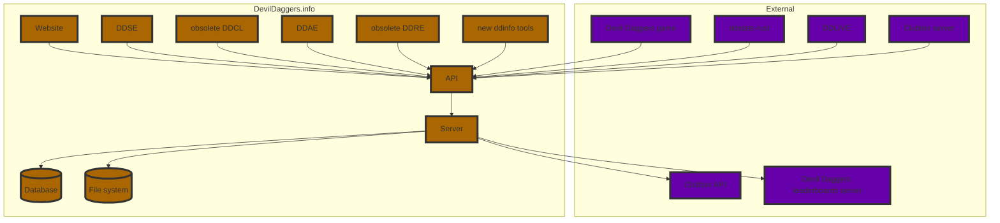

# Communication

The project communicates with various external sources.

```mermaid
flowchart TD;
	database[(Database)]
	filesystem[(File system)]
	server[Server]
	api[API]
	devildaggersinfo[Website]
	devildaggers[Devil Daggers game]
	ddse[DDSE]
	ddcl[obsolete DDCL]
	ddae[DDAE]
	ddre[obsolete DDRE]
	tools[new ddinfo tools]
	ddstatsrust[ddstats-rust]
	ddlive[DDLIVE]
	clubberserver[Clubber server]
	clubberapi[Clubber API]
	devildaggersleaderboards[Devil Daggers leaderboards server]

	class database,filesystem,server,api,devildaggersinfo,ddse,ddcl,ddae,ddre,tools ddinfo;
	class devildaggers,ddstatsrust,ddlive,clubberserver,clubberapi,devildaggersleaderboards external;

	classDef ddinfo fill:#a60,stroke:#333,stroke-width:4px;
	classDef external fill:#60a,stroke:#333,stroke-width:4px;

	subgraph External
		devildaggers
		ddstatsrust
		ddlive
		clubberserver
		clubberapi
		devildaggersleaderboards
	end

	devildaggers --> api
	ddstatsrust --> api
	ddlive --> api
	clubberserver --> api

	server --> devildaggersleaderboards
	server --> clubberapi

	subgraph DevilDaggers.info
		server --> database
		server --> filesystem

		api --> server

		devildaggersinfo --> api
		ddse --> api
		ddcl --> api
		ddae --> api
		ddre --> api
		tools --> api
	end
```
