```mermaid
flowchart TD;
	ddae[DDAE 2]
	ddcl[DDCL 2]
	ddre[DDRE 1]
	ddse[DDSE 3]

	core_asset[Core.Asset]
	core_encryption[Core.Encryption]
	core_mod[Core.Mod]
	core_replay[Core.Replay]
	core_spawnset[Core.Spawnset]
	core_wiki[Core.Wiki]

	app_core_apiclient[App.Core.ApiClient]
	app_core_gamememory[App.Core.GameMemory]
	app_core_nativeinterface[App.Core.NativeInterface]

	razor_appmanager[Razor.AppManager]
	razor_asseteditor[Razor.AssetEditor]
	razor_customleaderboard[Razor.CustomLeaderboard]
	razor_replayeditor[Razor.ReplayEditor]
	razor_survivaleditor[Razor.SurvivalEditor]

	razor_core_canvasarena[Razor.Core.CanvasArena]
	razor_core_canvaschart[Razor.Core.CanvasChart]
	razor_core_components[Razor.Core.Components]
	razor_core_canvas[Razor.Core.Canvas]

	web_client[Web.Client]
	web_server[Web.Server]
	web_server_domain[Web.Server.Domain]

	web_core_claims[Web.Core.Claims]

	api_dd[Api.Dd]
	api_clubber[Api.Clubber]
	api_ddlive[Api.DdLive]
	api_ddrust[Api.DdstatsRust]
	api_main[Api.Main]
	api_admin[Api.Admin]
	api_ddae[Api.Ddae]
	api_ddcl[Api.Ddcl]
	api_ddre[Api.Ddre]
	api_ddse[Api.Ddse]

	class api_dd,api_clubber,api_ddlive,api_ddrust,api_ddae,api_ddcl,api_ddre,api_ddse,api_main,api_admin api;
	classDef api fill:#660,stroke:#333,stroke-width:4px;

	class ddae,ddcl,ddre,ddse app;
	classDef app fill:#a00,stroke:#333,stroke-width:4px;

	class app_core_apiclient,app_core_gamememory,app_core_nativeinterface app_core;
	classDef app_core fill:#306,stroke:#333,stroke-width:4px;

	class core_asset,core_encryption,core_mod,core_replay,core_spawnset,core_wiki core;
	classDef core fill:#006,stroke:#333,stroke-width:4px;

	class razor_appmanager,razor_asseteditor,razor_customleaderboard,razor_replayeditor,razor_survivaleditor razor;
	classDef razor fill:#800,stroke:#333,stroke-width:4px;

	class razor_core_canvasarena,razor_core_canvaschart,razor_core_components,razor_core_canvas razor_core;
	classDef razor_core fill:#500,stroke:#333,stroke-width:4px;

	class web_client web_client;
	classDef web_client fill:#a66,stroke:#333,stroke-width:4px;

	class web_core_claims web_core;
	classDef web_core fill:#00a,stroke:#333,stroke-width:4px;

	class web_server,web_server_domain web_server;
	classDef web_server fill:#383,stroke:#333,stroke-width:4px;

	subgraph Core
		core_encryption

		razor_core_components

		core_mod --> core_asset
		core_replay --> core_spawnset
		core_spawnset --> core_wiki

		razor_core_canvasarena --> razor_core_canvas
		razor_core_canvaschart --> razor_core_canvas
	end

	subgraph App Core
		app_core_apiclient

		app_core_gamememory --> app_core_nativeinterface
	end

	subgraph Api App
		api_ddae
		api_ddcl
		api_ddre
		api_ddse
	end

	razor_asseteditor --> api_ddae
	razor_customleaderboard --> api_ddcl
	razor_replayeditor --> api_ddre
	razor_survivaleditor --> api_ddse

	razor_appmanager --> app_core_apiclient
	razor_asseteditor --> app_core_apiclient
	razor_customleaderboard --> app_core_apiclient
	razor_replayeditor --> app_core_apiclient
	razor_survivaleditor --> app_core_apiclient

	razor_appmanager --> razor_core_components
	razor_asseteditor --> razor_core_components
	razor_customleaderboard --> razor_core_components
	razor_replayeditor --> razor_core_components
	razor_survivaleditor --> razor_core_components

	web_server --> api_dd
	web_server --> api_clubber
	web_server --> api_ddlive
	web_server --> api_ddrust
	web_client --> api_main
	web_client --> api_admin
	web_server --> api_ddae
	web_server --> api_ddcl
	web_server --> api_ddre
	web_server --> api_ddse

	subgraph Razor
		razor_asseteditor ----> core_mod
		razor_customleaderboard ----> core_encryption
		razor_replayeditor ----> core_replay
		razor_survivaleditor ----> core_spawnset
		
		razor_customleaderboard ----> app_core_gamememory
		razor_replayeditor ----> app_core_gamememory

		razor_appmanager --> app_core_nativeinterface
		razor_asseteditor --> app_core_nativeinterface
		razor_survivaleditor --> app_core_nativeinterface
	end

	subgraph Web
		web_client ----> razor_core_canvasarena
		web_client ----> razor_core_canvaschart
		web_client ----> razor_core_components
		web_client --> web_core_claims
		web_client ----> core_mod
		web_client ----> core_replay
		web_client ----> core_spawnset

		web_server ------> core_encryption
		web_server --> web_client
		web_server --> web_server_domain

		web_server_domain --> core_mod
		web_server_domain --> core_replay
		web_server_domain --> core_spawnset
		web_server_domain --> web_core_claims

		api_dd
		api_clubber
		api_ddlive
		api_ddrust
		api_main
		api_admin
	end

	subgraph App
		ddae --> razor_asseteditor
		ddcl --> razor_customleaderboard
		ddre --> razor_replayeditor
		ddse --> razor_survivaleditor
	end
```

# Project types and dependencies

## Layers

DevilDaggersInfo is separated into layers, then into project types, then into individual projects (C# projects).

### Library layer

| **Subfolder** | **Project type**                                          | **Can depend on**                                                          |
|---------------|-----------------------------------------------------------|----------------------------------------------------------------------------|
| `api`         | API specifications                                        | `types`                                                                    |
| `common`      | Common functionality                                      | Nothing                                                                    |
| `core`        | Core set of features                                      | `common`, `core`, `types (Core only)`                                      |
| `types`       | [Enum types](types-libraries.md)                          | `common`                                                                   |

### UI layer

| **Subfolder** | **Project type**                                          | **Can depend on**                                                          |
|---------------|-----------------------------------------------------------|----------------------------------------------------------------------------|
| `razor-core`  | Reusable Razor UI libraries                               | `api`, `common`, `core`, `razor-core`, `types`                             |

### App layer

| **Subfolder** | **Project type**                                          | **Can depend on**                                                          |
|---------------|-----------------------------------------------------------|----------------------------------------------------------------------------|
| `app`         | UI app heads that run natively                            | `common`, `core`, `razor-core`, `razor`, `types`                           |
| `app-core`    | Core set of features for apps                             | `common`, `core`                                                           |
| `razor`       | Razor UI libraries for apps or web clients                | `app-core`, `common`, `core`, `razor-core`, `types`                        |

### Web layer

| **Subfolder** | **Project type**                                          | **Can depend on**                                                          |
|---------------|-----------------------------------------------------------|----------------------------------------------------------------------------|
| `web-client`  | Client apps that run in the browser (Blazor WebAssembly)  | `api`, `common`, `core`, `razor-core`, `razor`, `types`, `web-core`,       |
| `web-core`    | Reusable web logic                                        | `common`, `core`, `web-core`                                               |
| `web-server`  | Server code base (ASP.NET Core)                           | `api`, `common`, `core`, `types`, `web-client`, `web-core`, `web-server`   |

### Miscellaneous

| **Subfolder** | **Project type**                                          | **Can depend on**                                                          |
|---------------|-----------------------------------------------------------|----------------------------------------------------------------------------|
| `cmd`         | Console apps                                              | `common`, `core`                                                           |
| `tests`       | Unit tests                                                | Anything                                                                   |
| `tool`        | Tools for internal usage                                  | Anything                                                                   |

## Forbidden dependencies

In order to keep the architecture clean, certain dependencies are forbidden. The [core libraries](core-libraries.md) are reusable libraries that one or more other project types can depend on, including libraries of the project type itself. For example, a `razor-core` project can depend on another `razor-core` project, but a `razor` project (which is not a core library) cannot depend on another `razor` project.

## Separated app heads

The UI logic for each app lives in its own UI library. These are not tied to app heads. This allows the apps to switch between framework very easily. For instance, a .NET MAUI version for DDAE could easily be created without affecting the current Photino version of the app.

## End state chart (summary)

(May be outdated)

```mermaid
flowchart TD;
	apps[Apps]
	razor[Razor libs]
	app_core[App Core libs]

	core[Core libs]

	razor_core[Razor Core libs]

	web_client[Web.Client]
	web_server[Web.Server]
	web_server_domain[Web.Server.Domain]
	web_core_claims[Web.Core.Claims]

	api_ext[API external]
	api_web[API web]
	api_app[API apps]

	class api_ext,api_web,api_app api;
	classDef api fill:#660,stroke:#333,stroke-width:4px;

	class apps app;
	classDef app fill:#a00,stroke:#333,stroke-width:4px;

	class app_core app_core;
	classDef app_core fill:#306,stroke:#333,stroke-width:4px;

	class core core;
	classDef core fill:#006,stroke:#333,stroke-width:4px;

	class razor razor;
	classDef razor fill:#800,stroke:#333,stroke-width:4px;

	class razor_core razor_core;
	classDef razor_core fill:#500,stroke:#333,stroke-width:4px;

	class web_client web_client;
	classDef web_client fill:#a66,stroke:#333,stroke-width:4px;

	class web_core_claims web_core;
	classDef web_core fill:#00a,stroke:#333,stroke-width:4px;

	class web_server,web_server_domain web_server;
	classDef web_server fill:#383,stroke:#333,stroke-width:4px;

	apps --> razor

	razor --> razor_core
	razor --> app_core
	razor --> api_app

	web_server --> api_ext
	web_client --> api_web
	web_server --> api_app

	subgraph App <-> Web
		api_app
	end

	subgraph Core
		core
		razor_core
	end

	subgraph App
		apps

		razor ----> core
		razor ----> app_core
	end

	subgraph Web
		web_client ----> razor_core
		web_client --> web_core_claims
		web_client ----> core

		web_server ------> core
		web_server --> web_client
		web_server --> web_server_domain

		web_server_domain --> core
		web_server_domain --> web_core_claims

		api_ext
		api_web
	end
```

## End state chart (detailed)

(May be outdated)


