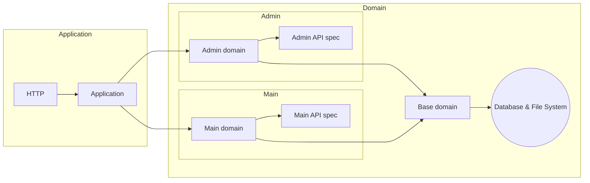

# Web server

## Repositories and services

Data is accessed via repositories (read-only), and modified via services (read and write). Both repositories and services have direct access to the database and file system. A service cannot depend on a repository and must communicate with the database directly.

### Structure

Repositories and services are defined in the web server domain projects. Note how there is a difference between the domain projects:

- Base domain
- Admin domain
- Main domain

All subdomains depend on the base domain.

#### Specific Domain projects

A repository or service should be defined in the subdomain project if the associated API specification of that project is its only concern. For example; editing custom entries can only be done through the admin API. Therefore, `CustomEntryService` (injected in `Admin.CustomEntriesController`) should be defined in the `Domain.Admin` project. Because there is only one API, the API specification can directly be used in these subdomains (which is also the reason why they are split from the base domain, since the base domain should not be able to have a dependency on any API specification).

#### Domain (base) project

However, some repositories and services are required by multiple APIs. For example, fetching custom leaderboards can be done from the website, DDCL, DDLIVE, and possibly more. Therefore, `CustomLeaderboardRepository` should be defined in the `Domain` (base) project. To work around the issue of having multiple API specs, these repositories and services should make use of _models and commands_, rather than DTOs from an API specification.
